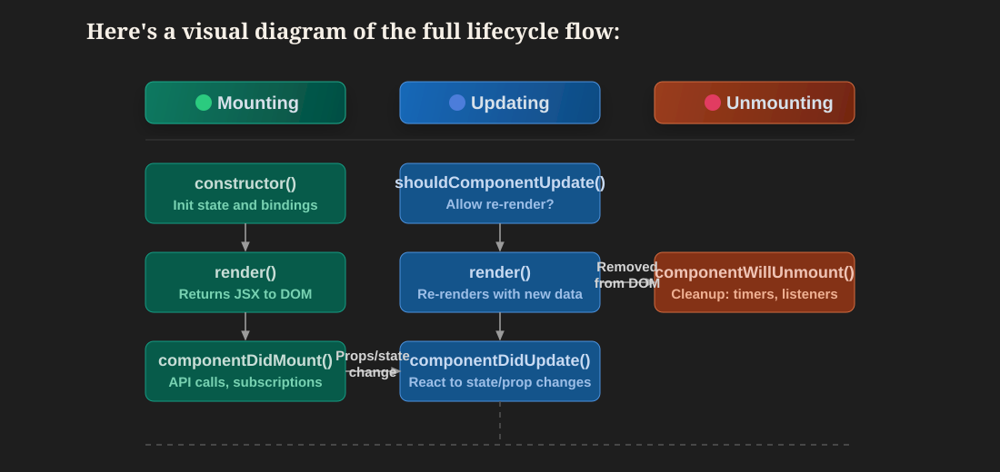

# Components

Components are the building blocks of a React application. A component is a reusable piece of UI that can contain JSX, JavaScript logic, props, state, and events.

## What is a Component?

A component is a JavaScript function or class that returns JSX.

Example:

```jsx
function Welcome() {
  return <h1>Welcome to React</h1>
}
```

React applications are usually made by combining many small components.

## Why Components are Used

Components help us:

- Reuse UI code.
- Split a large UI into smaller parts.
- Keep code clean and organized.
- Maintain large applications easily.
- Test and update one part of the UI without touching everything.

## Types of Components

There are two common ways to write components:

- Functional components
- Class components

Modern React mainly uses **functional components** with hooks. Class components are older, but they are still useful to understand for interviews and older codebases.

## Stateless Functional Component

A stateless functional component is a component that does not manage its own state.

```jsx
function Greeting() {
  return <h1>Hello, React Learner</h1>
}

export default Greeting
```

## Stateful Class Component

A stateful class component is a class-based component that manages its own state.

```jsx
import { Component } from "react"

class Counter extends Component {
  constructor() {
    super()

    this.state = {
      count: 0,
    }
  }

  increaseCount = () => {
    this.setState({
      count: this.state.count + 1,
    })
  }

  render() {
    return (
      <div>
        <h1>Count: {this.state.count}</h1>
        <button onClick={this.increaseCount}>Increase</button>
      </div>
    )
  }
}

export default Counter
```

In this example:

- `this.state` stores component data.
- `this.setState()` updates the state.
- `render()` returns JSX.

## Functional Component with State

In modern React, we use the `useState` hook instead of class component state.

```jsx
import { useState } from "react"

function Counter() {
  const [count, setCount] = useState(0)

  return (
    <div>
      <h1>Count: {count}</h1>
      <button onClick={() => setCount(count + 1)}>Increase</button>
    </div>
  )
}

export default Counter
```

## Practice Folder Structure

```text
02-components/
|-- README.md
|-- examples/
|   |-- StatelessFunctionalComponent.jsx
|   |-- StatefulClassComponent.jsx
|   `-- FunctionalComponentWithState.jsx
`-- src/
    |-- App.jsx
    `-- components/
        |-- Header.jsx
        |-- ProfileCard.jsx
        `-- Footer.jsx
```

## Common Mistakes

- Component name starts with lowercase.
- Component is created but not exported.
- Component is exported but not imported.
- Returning multiple elements without a parent element or fragment.
- Creating one very large component instead of smaller reusable components.

## Best Practices

- Use functional components for new React code.
- Start component names with capital letters.
- Keep components small and focused.
- Use props to pass data into components.
- Use state only when data changes over time.
- Move repeated UI into reusable components.

## Component Lifecycle

Component lifecycle means the different stages a React component goes through from creation to removal.

A component mainly has three lifecycle stages:

1. **Mounting**: The component is created and added to the screen.
2. **Updating**: The component re-renders because state or props changed.
3. **Unmounting**: The component is removed from the screen.

Lifecycle is important because sometimes we need to run code at a specific stage, such as:

- Fetching data when a component first appears.
- Updating the document title when state changes.
- Adding and removing event listeners.
- Starting and clearing timers.
- Cleaning API subscriptions or other side effects.



### Lifecycle in Class Components

In older React code, lifecycle was commonly handled with class component methods.

Example:

```jsx
import React from "react"

class UserProfile extends React.Component {
  componentDidMount() {
    console.log("Component mounted")
  }

  componentDidUpdate() {
    console.log("Component updated")
  }

  componentWillUnmount() {
    console.log("Component removed")
  }

  render() {
    return <h1>User Profile</h1>
  }
}
```

Important class lifecycle methods:

| Lifecycle Stage | Class Method | When It Runs |
| --- | --- | --- |
| Mounting | `componentDidMount()` | After the component is added to the screen |
| Updating | `componentDidUpdate()` | After props or state changes and the component re-renders |
| Unmounting | `componentWillUnmount()` | Just before the component is removed |

Class components are still valid React, and we may see them in older projects. But in modern React, functional components are used more often.

### Lifecycle in Functional Components

Currently, we mostly use functional components. Functional components do not have lifecycle methods like `componentDidMount()` or `componentDidUpdate()`.

Instead, we use the `useEffect` hook to handle lifecycle behavior.

Example:

```jsx
import { useEffect } from "react"

function UserProfile() {
  useEffect(() => {
    console.log("Component mounted")
  }, [])

  return <h1>User Profile</h1>
}
```

In this example, `useEffect` runs after the component is first shown on the screen.

### Functional Component Lifecycle Patterns

#### 1. Run Only Once After Mounting

This works like `componentDidMount()`.

```jsx
useEffect(() => {
  console.log("Component mounted")
}, [])
```

The empty dependency array `[]` means the effect runs only once after the first render.

#### 2. Run When State or Props Change

This works like `componentDidUpdate()` for selected values.

```jsx
useEffect(() => {
  console.log("Count changed")
}, [count])
```

This effect runs when the value of `count` changes.

#### 3. Run Cleanup Before Unmounting

This works like `componentWillUnmount()`.

```jsx
useEffect(() => {
  const timer = setInterval(() => {
    console.log("Timer running")
  }, 1000)

  return () => {
    clearInterval(timer)
    console.log("Cleanup completed")
  }
}, [])
```

The function returned from `useEffect` is called a cleanup function. It runs before the component is removed from the screen.

### Class Component vs Functional Component Lifecycle

| Requirement | Class Component | Functional Component |
| --- | --- | --- |
| Run code after first render | `componentDidMount()` | `useEffect(() => {}, [])` |
| Run code after update | `componentDidUpdate()` | `useEffect(() => {}, [value])` |
| Run cleanup before removal | `componentWillUnmount()` | `return () => {}` inside `useEffect` |
| Modern React preference | Less common now | Recommended for most new code |

### Simple Lifecycle Example

```jsx
import { useEffect, useState } from "react"

function Counter() {
  const [count, setCount] = useState(0)

  useEffect(() => {
    document.title = `Count: ${count}`
  }, [count])

  return (
    <button onClick={() => setCount(count + 1)}>
      Count: {count}
    </button>
  )
}
```

In this example:

- The component mounts when `Counter` appears on the screen.
- The component updates when `count` changes.
- The `useEffect` runs after every `count` update.

### Component Lifecycle Questions and Answers

#### 1. What is component lifecycle in React?

Component lifecycle is the journey of a component from being created, updated, and finally removed from the screen.

#### 2. What are the main lifecycle stages?

The main lifecycle stages are mounting, updating, and unmounting.

#### 3. What is mounting?

Mounting means the component is created and inserted into the DOM for the first time.

#### 4. What is updating?

Updating happens when a component re-renders because its state or props changed.

#### 5. What is unmounting?

Unmounting means the component is removed from the DOM.

#### 6. Which lifecycle method runs after a class component mounts?

`componentDidMount()` runs after a class component is mounted.

#### 7. Which lifecycle method runs after a class component updates?

`componentDidUpdate()` runs after a class component updates.

#### 8. Which lifecycle method runs before a class component is removed?

`componentWillUnmount()` runs before a class component is removed.

#### 9. Do functional components have lifecycle methods?

No. Functional components do not use class lifecycle methods. They use hooks like `useEffect` to handle lifecycle behavior.

#### 10. How do we run code only once in a functional component?

We use `useEffect` with an empty dependency array.

```jsx
useEffect(() => {
  console.log("Runs once")
}, [])
```

#### 11. How do we run code when a value changes?

We add that value inside the dependency array.

```jsx
useEffect(() => {
  console.log("Name changed")
}, [name])
```

#### 12. What is cleanup in `useEffect`?

Cleanup is code that runs before the component unmounts or before the effect runs again. It is useful for clearing timers, removing event listeners, and stopping subscriptions.

```jsx
useEffect(() => {
  window.addEventListener("resize", handleResize)

  return () => {
    window.removeEventListener("resize", handleResize)
  }
}, [])
```

#### 13. Which is preferred today: class components or functional components?

Functional components are preferred in modern React because they are simpler and work well with hooks. Class components are still important to understand because many older React projects use them.

#### 14. Is `useEffect` exactly the same as class lifecycle methods?

No. `useEffect` can behave like lifecycle methods in many common cases, but it is based on effects and dependencies. In functional components, we think in terms of "run this effect when these values change."

## Interview Questions

### 1. What is a component in React?

A component is a reusable piece of UI that returns JSX.

### 2. What are the two main types of components?

Functional components and class components.

### 3. Which component type is preferred in modern React?

Functional components are preferred in modern React.

### 4. What is a stateless component?

A stateless component is a component that does not manage its own state.

### 5. What is a stateful component?

A stateful component is a component that manages data that can change over time.

### 6. Do we still use class components?

Class components are not commonly used in new React projects, but they may exist in older projects and can appear in interviews.

## Summary

- Components are reusable UI blocks.
- Functional components are the modern React standard.
- Class components are older but important for interview understanding.
- Stateless components do not manage state.
- Stateful components manage data that changes.
- Use hooks like `useState` for state in functional components.
- Component lifecycle has mounting, updating, and unmounting stages.
- Class components use lifecycle methods like `componentDidMount()`, `componentDidUpdate()`, and `componentWillUnmount()`.
- Functional components use `useEffect` to handle lifecycle behavior in modern React.
